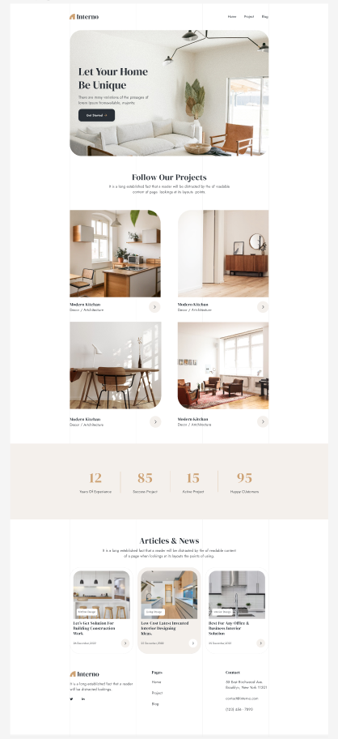
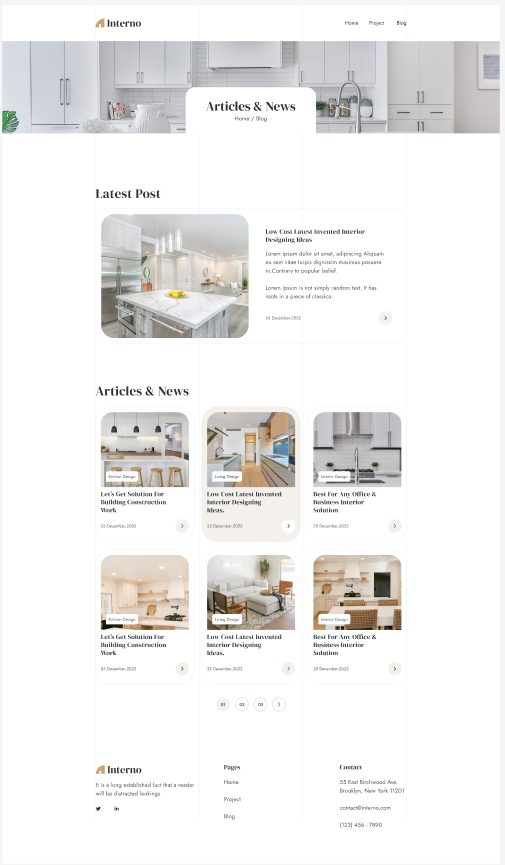
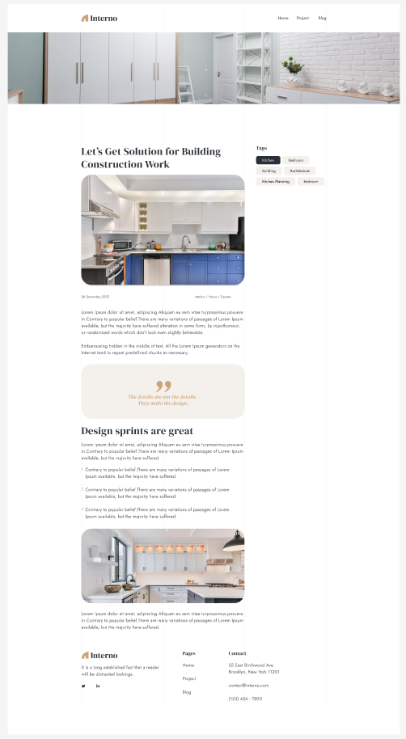
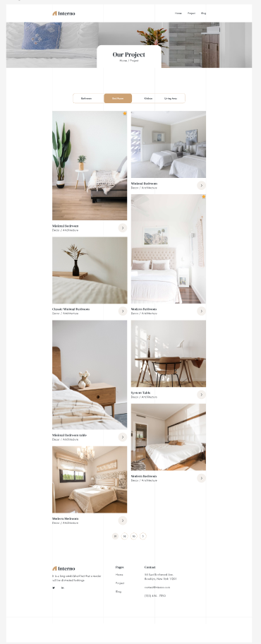
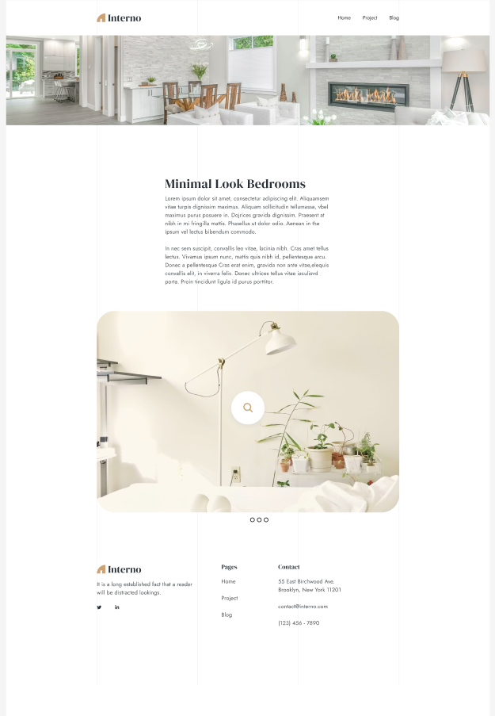
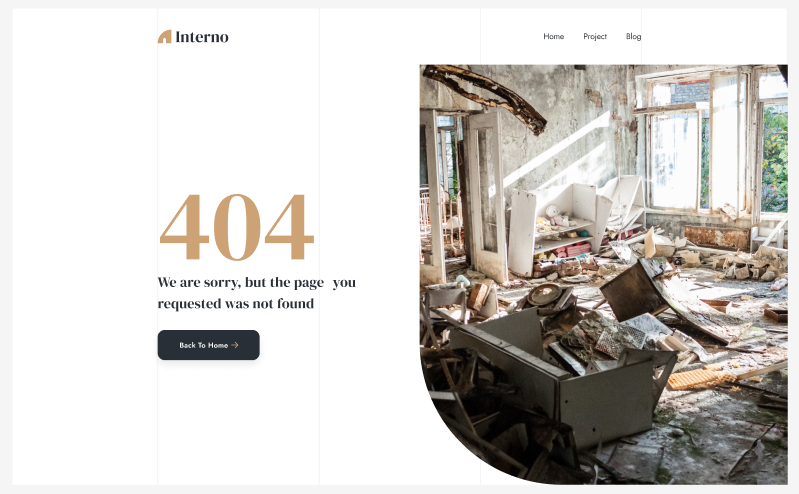

# Interno - interior design company website (Interno - вебсайт компании дизайна интеръеров)

## Description(RU) (Описание)
Interno - это мой первый учебный проект написанный на фреймворке VueJS, с использованием библиотеки храненеия и распределения данных Vuex и маршрутизации Vue Router. Работа с данным приложением была направлена на ознакомление с тонкостями и нюансами самых распространенных функциональностей современных веб-приложений. Под функциональностью я подразумеваю слудующее: пагнинация, роутинг, фильтрация, работа с навигацией, адаптивность под разные разрешения, разнообразные переключатели, слайдеры и т.д. Наполнение приложения состоит из изображений представленных в макете, поэтому порой переходя по табам изображения либо будут повторяться, либо будут не совпадать с назначением таба. Также учитывая, что работа с Vue и в целом работа с разработкой фронтенда осуществлялась впервые, все изображения не были оптимизированы (сжаты и переведены в jpg), а также некоторые переходы, возможно, выполнены нелогично, ведь цель данного проекта была, именно, в пробе себя в качествве разработчика на VueJS. Ознакомиться с лайв-версией можно,перейдя по ссылке  https://gb-vue-js.vercel.app/projects/. 

## Description(En)
Interno is my first educational project written on the VueJS framework, using the Vuex data storage and distribution library and Vue Router routing. Working with this application was aimed at familiarizing myself with the intricacies and nuances of the most common functionalities of modern web applications. By functionality, I mean the following: pagination, routing, filtering, working with navigation, adaptability to different resolutions, various switches, sliders, etc. The application content consists of images presented in the layout, so sometimes when switching between tabs, the images will either be repeated or will not match the purpose of the tab. Also, given that working with Vue and, in general, working with frontend development was carried out for the first time, all images were not optimized (compressed and converted to jpg), and some transitions may have been performed illogically, because the goal of this project was precisely to try myself as a VueJS developer. You can check out the live version by following the link https://gb-vue-js.vercel.app/projects/.

## Technologies used (Используемые технологии)
* VueJs
* Vuex
* Vue Router
* SCSS

## Visual display of the application's operation (Визуальное отображение функциональности или экранов приложения)
<div style="display: flex; flex-direction: column; justify-content: center; align-items: center;">
  <div style="text-align: center; max-width: 500px;">
    
    <p><b>Picture 1.</b> Homepage.</p>
  </div>
  <div style="text-align: center; max-width: 500px;">
    
    <p><b>Picture 2.</b> Blog page.</p>
  </div>
  <div style="text-align: center;  max-width: 500px;">
    
    <p><b>Picture 3.</b> Blog details page.</p>
  </div>
  <div style="text-align: center;  max-width: 500px;">
    
    <p><b>Picture 4.</b> Project page.</p>
  </div>
  <div style="text-align: center;  max-width: 500px;">
    
    <p><b>Picture 5.</b> Project Details page.</p>
  </div>
  <div style="text-align: center;  max-width: 500px;">
    
    <p><b>Picture 6.</b> Not Found page.</p>
  </div>
</div>


## Project setup
```
npm install
```

### Compiles and hot-reloads for development
```
npm run serve
```

### Compiles and minifies for production
```
npm run build
```

### Customize configuration
See [Configuration Reference](https://cli.vuejs.org/config/).
